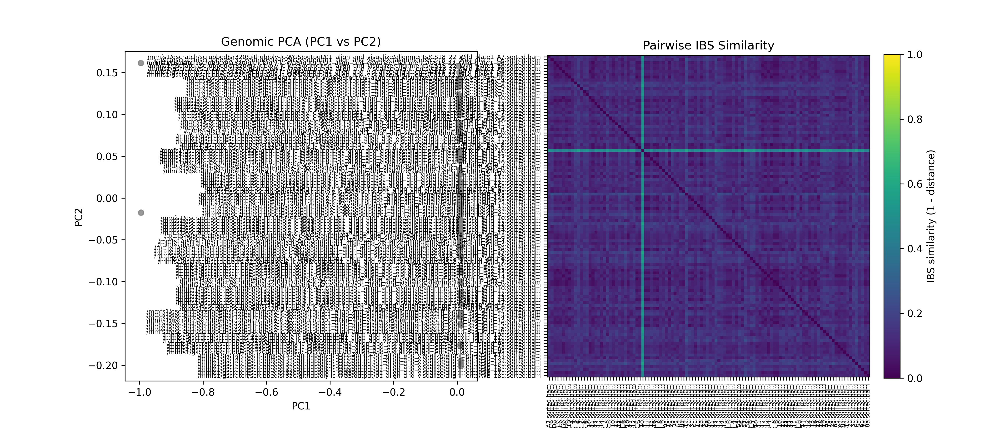
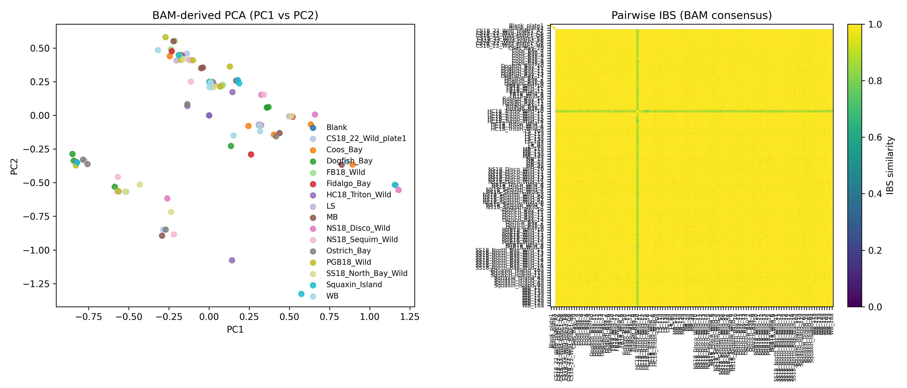

# oly-lc-WGS

Low-coverage whole-genome sequencing (lc-WGS) workflow for Olympia oyster samples.
The repository contains Python pipelines for alignment, BAM-based diversity
summaries, and variant-level quality summaries, with outputs written to
step-matched subdirectories under `output/`.

## Repository layout

| Path | Contents |
| --- | --- |
| `code/` | Analysis scripts run in numeric order (`01_` → `03_`) |
| `data/` | Raw reads and reference assets used as read-only inputs |
| `output/` | Generated alignments, tables, figures, logs, and metadata |
| `INSTRUCTIONS.md` | Project execution conventions for agents and contributors |

Additional details for each analysis step are documented in
[`code/README.md`](code/README.md).

## Workflow overview

| Step | Script | Purpose | Key outputs |
| --- | --- | --- | --- |
| 1 | `code/01_align_and_visualize.py` | Align paired-end FASTQs to the Olympia oyster reference, build a joint VCF/PLINK dataset, and visualize genetic connectedness | `output/01_align_and_visualize/alignments/`, `variants/`, `metrics/`, `figures/genetic_connectedness.png` |
| 2 | `code/02_bam_summary.py` | Summarize mismatch, heterozygosity, IBS, and PCA directly from BAMs without rerunning variant calling | `output/02_bam_summary/tables/`, `figures/bam_connectedness.png` |
| 3 | `code/03_variant_summary.py` | Generate VCF/PLINK-based variant quality and diversity summaries | `output/03_variant_summary/` |

## Requirements

Run commands from the repository root and keep `data/` read-only.

- Python 3 with `numpy` and `pandas`
- `pysam` for `code/02_bam_summary.py`
- External tools used by the workflows:
  - step 01: `bwa`, `samtools`, `bcftools`, `plink`
  - step 02: `samtools`
  - step 03: `bcftools`, `plink`

## Typical usage

```bash
python code/01_align_and_visualize.py --threads 32 --threads-per-sample 4
python code/02_bam_summary.py --num-sites 500
python code/03_variant_summary.py --threads 32
```

All outputs are written with relative paths so results remain reproducible across
systems.

## Results to date

The checked-in outputs currently document completed work for the alignment and
BAM-summary stages.

### Current dataset snapshot

| Metric | Value |
| --- | --- |
| Samples discovered in `sample_metadata.tsv` | 112 |
| Inferred locations/categories | 16 total |
| Blank/control samples | 2 |
| Biological locations | 15 |
| Sorted BAMs produced | 112 |
| Joint variant files produced by step 01 | `all_samples.raw.vcf.gz`, `all_samples.filtered.vcf.gz` |

### Sample counts by inferred location

| Location | Samples |
| --- | ---: |
| Blank | 2 |
| CS18_22_Wild_plate1 | 7 |
| Coos_Bay | 7 |
| Dogfish_Bay | 8 |
| FB18_Wild | 5 |
| Fidalgo_Bay | 5 |
| HC18_Triton_Wild | 8 |
| LS | 7 |
| MB | 8 |
| NS18_Disco_Wild | 8 |
| NS18_Sequim_Wild | 8 |
| Ostrich_Bay | 8 |
| PGB18_Wild | 8 |
| SS18_North_Bay_Wild | 8 |
| Squaxin_Island | 7 |
| WB | 8 |

### Summary metrics from committed outputs

These values come from `output/01_align_and_visualize/metrics/coverage_summary.tsv`
and `output/02_bam_summary/tables/`.

| Summary | Current value |
| --- | --- |
| Mean genome coverage across non-blank samples | 0.480 covered fraction (48.0%) |
| Mean genome-wide depth across non-blank samples | 5.44× |
| Mean location-level BAM heterozygosity | 0.00824 |
| Mean location-level BAM mismatch rate | 0.00530 |
| Highest location-level heterozygosity | `FB18_Wild` (0.01457) |
| Highest location-level mean depth at sampled BAM sites | `Ostrich_Bay` (14.91) |
| Highest location-level mismatch rate | `HC18_Triton_Wild` (0.00979) |
| Highest per-sample heterozygosity in BAM summary | `FB18_Wild_11` (0.02283) |

### Generated figures

Step 01 connectedness figure:



Step 02 BAM-based connectedness figure:



### Current status of later-stage summaries

The variant-summary script is present in `code/03_variant_summary.py`, but the
checked-in repository outputs currently center on steps 01 and 02; no committed
`output/03_variant_summary/` results are present yet.
