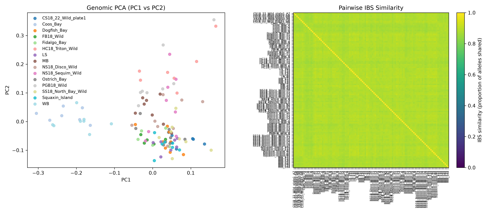
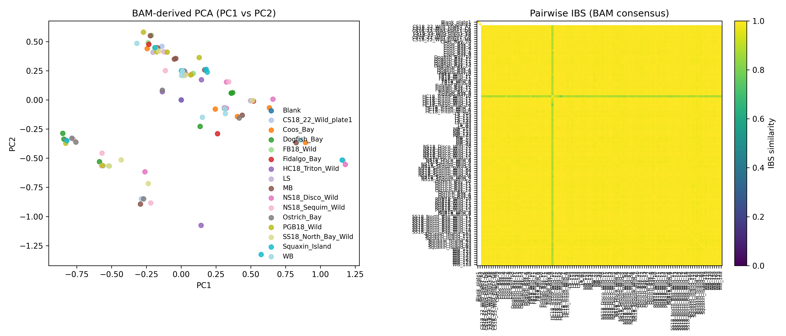
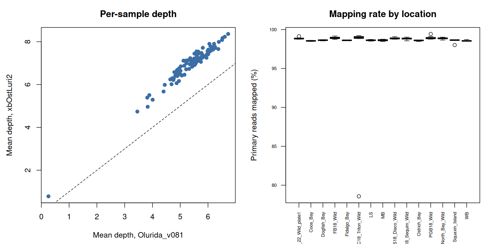
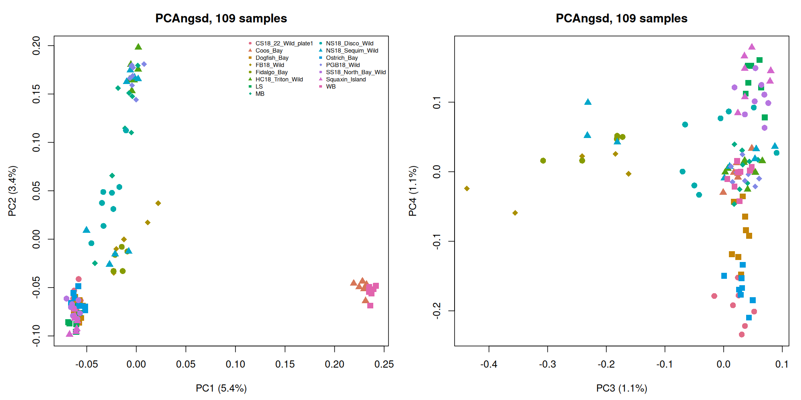
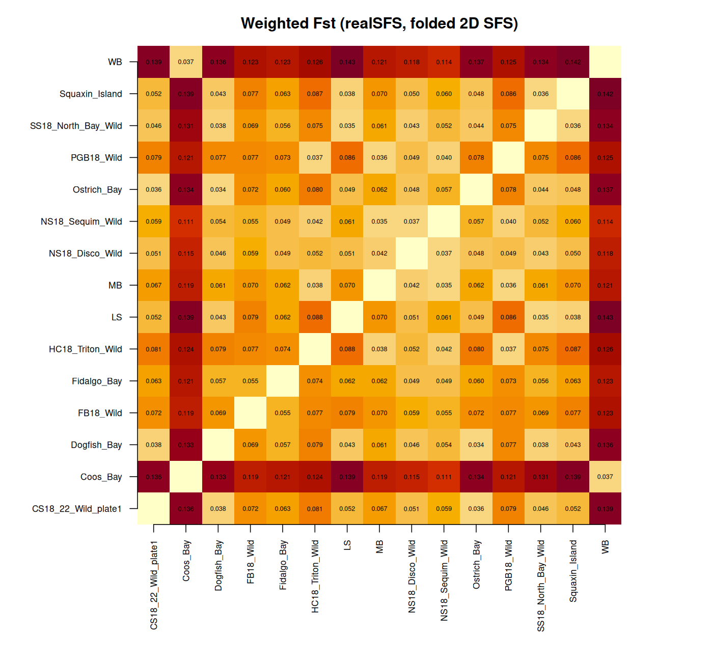

# oly-lc-WGS

Low-coverage whole-genome sequencing (lc-WGS) workflow for Olympia oyster samples.
The repository contains Python pipelines for alignment, BAM-based diversity
summaries, and variant-level quality summaries, with outputs written to
step-matched subdirectories under `output/`.

## Repository layout

| Path | Contents |
| --- | --- |
| `code/` | Analysis scripts run in numeric order (`01_` → `10_`) |
| `data/` | Raw reads and reference assets used as read-only inputs |
| `output/` | Generated alignments, tables, figures, logs, and metadata |
| `INSTRUCTIONS.md` | Project execution conventions for agents and contributors |

Additional details for each analysis step are documented in
[`code/README.md`](code/README.md).

## Workflow overview

| Step | Script | Purpose | Key outputs |
| --- | --- | --- | --- |
| 1 | `code/01_align_and_visualize.py` | Align paired-end FASTQs to the Olympia oyster reference, build a joint VCF/PLINK dataset, and visualize genetic connectedness | `output/01_align_and_visualize/alignments/`, `variants/`, `metrics/`, `figures/genetic_connectedness.png` |
| 2 | `code/02_bam_summary.py` | Summarize mismatch, heterozygosity, IBS, and PCA directly from BAMs without rerunning variant calling | `output/02_bam_summary/tables/`, `figures/bam_connectedness.png` |
| 3 | `code/03_variant_summary.py` | Generate VCF/PLINK-based variant quality and diversity summaries | `output/03_variant_summary/` |
| 4 | `code/04_environmental_data.py` | Match each putative sampling site to nearby NOAA buoys/stations and download recent observations | `output/04_environmental_data/` |
| 5 | `code/05_realign_xbOstLuri2.Rmd` | Re-align all samples to the chromosome-level NCBI reference GCA_061535525.1 (xbOstLuri2) with read groups and duplicate marking, via SLURM array jobs | `output/05_realign_xbOstLuri2/alignments/`, `metrics/`, `figures/` |
| 6 | `code/06_angsd_structure.Rmd` | Genotype-likelihood population structure on the step 05 BAMs: ANGSD Beagle likelihoods, PCAngsd PCA and admixture, folded SFS diversity, and pairwise Fst for all 15 locations | `output/06_angsd_structure/tables/`, `figures/`, `pca/`, `sfs/`, `fst/` |
| 7 | `code/07_orca_ecology_data.py` | Site-level 2015–2018 marine climatologies (0–5 m temperature, salinity, oxygen, chlorophyll) from WA Ecology CTD profiles and ORCA moorings, as predictors for genotype-environment analyses | `output/07_orca_ecology_data/tables/site_predictors_ecology.tsv`, `figures/` |
| 8 | `code/08_environmental_predictors.py` | RDA predictor matrix from the step 07 climatologies: Coos Bay temperature from NOAA CO-OPS, dbMEM geography, collinearity and VIF screen of candidate predictors | `output/08_environmental_predictors/tables/site-env-matrix.tsv`, `figures/` |
| 9 | `code/09_rda.Rmd` (+ `code/09_rda_genotypes.py`) | Genotype-environment RDA: per-population allele frequencies from the step 06 genotype likelihoods, variance partitioning, permutation tests, temperature-only and individual-level models, and an outlier scan | `output/09_rda/tables/`, `figures/` |
| 10 | `code/10_talk_figures.py` | Slide-ready versions of the main step 05-09 figures: large text, plain site names, one region colour scheme | `output/10_talk_figures/figures/` |

## Requirements

Run commands from the repository root and keep `data/` read-only.

- Python 3 with `numpy` and `pandas`
- `pysam` for `code/02_bam_summary.py`
- External tools used by the workflows:
  - step 01: `bwa`, `samtools`, `bcftools`, `plink`
  - step 02: `samtools`
  - step 03: `bcftools`, `plink`
  - step 04: network access to NOAA NDBC and NOAA CO-OPS endpoints

## Typical usage

```bash
python code/01_align_and_visualize.py --threads 32 --threads-per-sample 4
python code/02_bam_summary.py --num-sites 500
python code/03_variant_summary.py --threads 32
python code/04_environmental_data.py --days 30 --radius-km 75
Rscript -e 'rmarkdown::render("code/05_realign_xbOstLuri2.Rmd")'   # or run its chunks in RStudio
Rscript -e 'rmarkdown::render("code/06_angsd_structure.Rmd")'      # submits SLURM jobs; rerun R chunks when done
python code/07_orca_ecology_data.py --start-year 2015 --end-year 2018
python code/08_environmental_predictors.py
# code/09_rda.Rmd: on klone run its bash chunks in order from a shell; R chunks run as SLURM jobs in the lab R container
python code/10_talk_figures.py --force
```

All outputs are written with relative paths so results remain reproducible across
systems.

## Results to date

The checked-in outputs currently document completed work for the alignment and
BAM-summary stages.

### Current dataset snapshot

| Metric | Value |
| --- | --- |
| Samples discovered in `sample_metadata.tsv` | 112 |
| Inferred locations/categories | 16 total |
| Blank/control samples | 2 |
| Biological locations | 15 |
| Sorted BAMs produced | 112 |
| Joint variant files produced by step 01 | `all_samples.raw.vcf.gz`, `all_samples.filtered.vcf.gz` |

### Sample counts by inferred location

| Location | Putative site (complete words) | Samples |
| --- | --- | ---: |
| Blank | Negative control (no oyster tissue) | 2 |
| CS18_22_Wild_plate1 | Central Sound wild collection, 2018 (Clam Bay / Manchester vicinity) | 7 |
| Coos_Bay | Coos Bay, Oregon (outside Puget Sound) | 7 |
| Dogfish_Bay | Dogfish Bay, Liberty Bay vicinity, Kitsap Peninsula, Puget Sound | 8 |
| FB18_Wild | Fidalgo Bay wild collection, 2018, Anacortes, northern Puget Sound | 5 |
| Fidalgo_Bay | Fidalgo Bay, Anacortes, northern Puget Sound | 5 |
| HC18_Triton_Wild | Triton Cove, Hood Canal, 2018 wild collection | 8 |
| LS | Little Skookum Inlet, southern Puget Sound | 7 |
| MB | Mud Bay, Eld Inlet, southern Puget Sound | 8 |
| NS18_Disco_Wild | Discovery Bay, north Olympic Peninsula, 2018 wild collection | 8 |
| NS18_Sequim_Wild | Sequim Bay, north Olympic Peninsula, 2018 wild collection | 8 |
| Ostrich_Bay | Ostrich Bay, Dyes Inlet, Bremerton, central Puget Sound | 8 |
| PGB18_Wild | Port Gamble Bay, 2018 wild collection, northern Hood Canal | 8 |
| SS18_North_Bay_Wild | North Bay, Case Inlet, southern Puget Sound, 2018 wild collection | 8 |
| Squaxin_Island | Squaxin Island, southern Puget Sound | 7 |
| WB | Stony Point, Willapa Bay, Washington coast (outside Puget Sound) | 8 |

The second column gives the collection site for each sample-name prefix. The
coordinates used for these sites in steps 04 and 05 are approximate centroids,
not recorded collection points.

### Summary metrics from committed outputs

These values come from `output/01_align_and_visualize/metrics/coverage_summary.tsv`
and `output/02_bam_summary/tables/`.

| Summary | Current value |
| --- | --- |
| Mean genome coverage across non-blank samples | 0.480 covered fraction (48.0%) |
| Mean genome-wide depth across non-blank samples | 5.44× |
| Mean location-level BAM heterozygosity | 0.00824 |
| Mean location-level BAM mismatch rate | 0.00530 |
| Highest location-level heterozygosity | `FB18_Wild` (0.01457) |
| Highest location-level mean depth at sampled BAM sites | `Ostrich_Bay` (14.91) |
| Highest location-level mismatch rate | `HC18_Triton_Wild` (0.00979) |
| Highest per-sample heterozygosity in BAM summary | `FB18_Wild_11` (0.02283) |

### Environmental context

`code/04_environmental_data.py` pairs each putative site with the buoys and
shore stations around it and pulls recent observations from NOAA NDBC and NOAA
CO-OPS. Results, including per-site water-temperature summaries and the full
station crosswalk, are in
[`output/04_environmental_data/`](output/04_environmental_data/README.md).

No NOAA in-water sensor sits inside the small inlets these oysters come from, so
the closest reporting station is typically a basin away (Tacoma for the South
Sound sites, Port Townsend for the north Sound and Hood Canal sites). The
NANOOS/UW ORCA moorings and Washington Dept. of Ecology's monthly CTD stations
are much closer — Ecology has a station within 4-21 km of every Puget Sound site
here — and both are openly accessible. Step 04 records them as pointers only;
[`docs/environmental-data-access-plan.md`](docs/environmental-data-access-plan.md)
documents the verified access paths, an inquiry to send to NANOOS/UW-APL, and
the plan for ingesting both sources.

### Generated figures

Step 01 connectedness figure:



> **Caveat.** This figure predates the fix to the PLINK contig selection in
> `code/01_align_and_visualize.py`. The PLINK dataset behind it contains
> 7,865 SNPs, all on `Contig19646` (194 kb, 0.02 % of the genome), because a
> stale one-contig `subset_for_plink.vcf.gz` was reused. The current code
> selects contigs from the reference `.fai` (default `>= 20 kb`, ~11.5k
> contigs, ~32 % of the assembly); rerun step 01 with `--force` to regenerate
> the PCA/IBS results and this figure. See `code/README.md` for details.

Step 02 BAM-based connectedness figure:



### Step 05 re-alignment to xbOstLuri2 (2026-09-27)

All 112 samples were re-aligned to the chromosome-level NCBI reference
GCA_061535525.1 (xbOstLuri2) by `code/05_realign_xbOstLuri2.Rmd`, with read
groups and duplicate marking. Every task completed; per-sample tables are in
[`output/05_realign_xbOstLuri2/metrics/`](output/05_realign_xbOstLuri2/metrics/).

| Metric (110 non-blank samples) | Olurida_v081 (step 01) | xbOstLuri2 (step 05) |
| --- | ---: | ---: |
| Mean depth, median across samples | 5.55x | 7.15x |
| Depth ratio xbOstLuri2 / v081, median | | 1.28 |
| Primary reads mapped, location means | | 96.5 to 99.0% |
| Duplicates (marked), location means | not marked | 12.5 to 21.6% |
| Mean MAPQ | 53 | 37 |

The lower mean MAPQ is expected: reads that v081 placed with low but nonzero
confidence among fragmented contigs are now MAPQ 0 on repeat copies that are
actually assembled, while the share of reads at MAPQ 30 or higher is unchanged
(67% in Coos_Bay_7 on both). Filter on MAPQ 20 or 30 downstream as before.
`HC18_Triton_Wild_10` remains the low-coverage outlier (0.78x, 79% mapped).



### Step 06 genotype-likelihood population structure (2026-09-28)

`code/06_angsd_structure.Rmd` analysed the 109 usable step 05 BAMs (blanks and
the 0.78x sample `HC18_Triton_Wild_10` excluded) with ANGSD and PCAngsd over the
10 chromosomes: 7,418,858 SNP sites for the PCA and admixture, and folded site
frequency spectra over about 620 million sites per population for diversity and
Fst. Tables and figures are in
[`output/06_angsd_structure/`](output/06_angsd_structure/).

Main findings:

- **The outer-coast sites form one group.** The eight WB (Willapa Bay, Stony
  Point) samples sit inside the Coos Bay cluster on PC1 (5.4% of variance),
  share one ancestry component with Coos Bay at every K, and have a weighted Fst
  of 0.037 to Coos Bay, the same as neighbouring sites within Puget Sound,
  against 0.11 to 0.14 to every Puget Sound site. Willapa Bay and Coos Bay are
  both outer Pacific coast estuaries, so the main split is outer coast versus
  Puget Sound.
- **Three Puget Sound groups**: South and Central Sound (LS, Squaxin Island,
  North Bay, Dogfish Bay, Ostrich Bay, CS18), Hood Canal (Triton Cove, Port
  Gamble) and a north Olympic Peninsula group (Sequim, Discovery Bay), with the
  Fidalgo Bay sets intermediate and carrying a small Coos Bay-like component.
  Weighted Fst within groups is 0.034 to 0.038 and between groups 0.04 to 0.09.
- **MB groups with Hood Canal**, not the South Sound (Fst 0.035 to Sequim and
  0.036 to Port Gamble, against 0.06 to 0.07 to the South Sound sites), despite
  Mud Bay's location in Eld Inlet.
- Nucleotide diversity is 0.0034 to 0.0040 per site. Tajima's D splits by
  sample-set naming (2018 wild sets near zero or negative, other sets 0.35 to
  0.49), which follows the duplicate-rate split seen in step 05 and may be a
  library-batch effect on the rare-variant tail rather than biology; the PCA
  shows no batch axis.





### Current status of later-stage summaries

The variant-summary script is present in `code/03_variant_summary.py`, but the
checked-in repository outputs currently center on steps 01 and 02; no committed
`output/03_variant_summary/` results are present yet.
