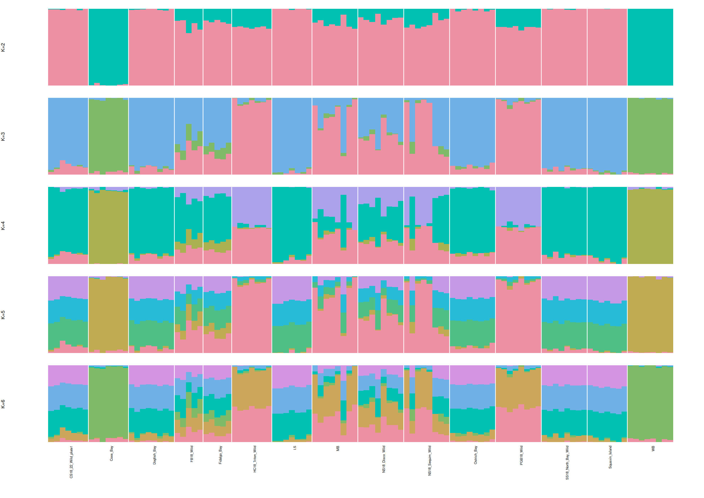

Population structure, admixture, diversity and differentiation for the 15
sampling locations, estimated from genotype likelihoods on the step 05
xbOstLuri2 alignments rather than from hard genotype calls. At 5 to 8x per
sample, called genotypes are biased toward homozygotes and the step 01 PCA
rested on 7,865 SNPs from one contig; this step uses the whole assembled genome.

What it produces:

- **PCA and admixture** (PCAngsd) from Beagle genotype likelihoods at
  polymorphic sites across the 10 chromosomes.
- **Per-population diversity** (Watterson's theta, pi, Tajima's D) from folded
  site frequency spectra (ANGSD `-doSaf`, `realSFS`, `thetaStat`).
- **Pairwise Fst** between all 105 location pairs from folded 2D SFS
  (`realSFS fst`).

Inputs and outputs:

- Input BAMs: `output/05_realign_xbOstLuri2/alignments/*.sorted.bam` (step 05)
- Input reference: `output/05_realign_xbOstLuri2/reference/*.fna` and `.fai`
- Sample selection: `output/05_realign_xbOstLuri2/metrics/coverage_summary.tsv`
  (blanks and samples under 2x mean depth are excluded; currently the two blanks
  and `HC18_Triton_Wild_10`, leaving 109 samples)
- Output: `output/06_angsd_structure/` — `samples/` (lists), `gl/` and `saf/`
  (large, gitignored), `pca/`, `sfs/`, `fst/`, `tables/`, `figures/`, `logs/`,
  `metadata.json`

Tools come from the conda env `angsd` under
`/mmfs1/gscratch/srlab/sr320/miniforge3/envs/angsd` (ANGSD 0.940, PCAngsd
1.36.4). To rebuild it:
`mamba create -n angsd -c conda-forge -c bioconda angsd pcangsd`.

Filters, applied identically to every ANGSD run: MAPQ >= 20, base quality >= 20,
unique proper pairs only, `-remove_bads 1` (drops the duplicates step 05
marked, flag 1024, along with secondary and QC-fail reads), BAQ with `-C 50`,
and a site must be covered in at least 80 percent of the samples in the run.
Total-depth bounds are set from the summed mean depth of the samples in the
run: at least a third and at most twice the expected total. Only the 10
chromosomes are used (995 of 1,029 Mb); the 507 unplaced scaffolds are skipped.

Every heavy chunk submits SLURM jobs on `coenv` / `cpu-g2` and returns at once,
recording job ids in `output/06_angsd_structure/tmp/<name>.jobid`. Chunks skip
work whose outputs exist, so the file can be rerun to pick up failed tasks.
Dependencies are chained with `--dependency=afterok`, so all of it can be
submitted in one sitting; `status` shows progress.

```{r setup, include=FALSE}
# Paths are relative to code/, so chunks work the same run one at a time or knitted
knitr::opts_chunk$set(echo = TRUE, eval = TRUE)
```

# Directories

```{bash dirs}
set -euo pipefail
mkdir -p ../output/06_angsd_structure/{samples,gl,pca,saf,sfs,fst,tables,figures,logs,tmp}
ls ../output/06_angsd_structure
```

# Samples, populations and regions

Builds the sample table from the step 05 coverage summary, one BAM list per
location, the list of 10 chromosomes, and 25 Mb windows over them for the
genotype-likelihood array. Change `min_depth` or `window` here and rerun.

```{bash samples}
set -euo pipefail
repo=$(cd .. && pwd)
out=output/06_angsd_structure
min_depth=2          # exclude samples below this mean depth (step 05 coverage_summary)
window=25000000      # bp per ANGSD genotype-likelihood task

cd "${repo}"
cov=output/05_realign_xbOstLuri2/metrics/coverage_summary.tsv
fai=$(ls output/05_realign_xbOstLuri2/reference/*.fna.fai)

# samples.tsv: sample_id, location, bam (repo-relative), meandepth
awk -F'\t' -v md="${min_depth}" 'NR==1{for(i=1;i<=NF;i++) h[$i]=i; print "sample_id\tlocation\tbam\tmeandepth"; next}
  $2!="Blank" && $h["meandepth"]>=md {print $1"\t"$2"\toutput/05_realign_xbOstLuri2/alignments/"$1".sorted.bam\t"$h["meandepth"]}' "${cov}" \
  > ${out}/samples/samples.tsv
awk -F'\t' -v md="${min_depth}" 'NR==1{for(i=1;i<=NF;i++) h[$i]=i; next} $2=="Blank" || $h["meandepth"]<md {print $1"\t"$2"\t"$h["meandepth"]}' "${cov}" \
  > ${out}/samples/excluded.tsv
tail -n +2 ${out}/samples/samples.tsv | awk -F'\t' -v r="${repo}" '{print r"/"$3}' > ${out}/samples/bam.list
tail -n +2 ${out}/samples/samples.tsv | cut -f2 | sort -u > ${out}/samples/pops.txt
while read -r pop; do
  awk -F'\t' -v p="${pop}" -v r="${repo}" '$2==p{print r"/"$3}' ${out}/samples/samples.tsv > ${out}/samples/${pop}.bams
done < ${out}/samples/pops.txt

# all unordered population pairs, for the Fst array
awk 'NR==FNR{a[NR]=$1; n=NR; next} END{for(i=1;i<=n;i++) for(j=i+1;j<=n;j++) print a[i]"\t"a[j]}' ${out}/samples/pops.txt /dev/null \
  > ${out}/samples/pairs.tsv

# chromosomes (CM accessions) and windows
python3 - "${fai}" "${window}" ${out}/samples <<'PY'
import json, sys
fai, window, sdir = sys.argv[1], int(sys.argv[2]), sys.argv[3]
chroms = [json.loads(l)["genbankAccession"] for l in open("data/genome/GCA_061535525.1_sequence_report.jsonl")
          if json.loads(l).get("role") == "assembled-molecule"]
length = {l.split("\t")[0]: int(l.split("\t")[1]) for l in open(fai)}
with open(f"{sdir}/chromosomes.txt", "w") as f:
    f.write("\n".join(chroms) + "\n")
with open(f"{sdir}/windows.tsv", "w") as f:
    for c in chroms:
        for start in range(1, length[c] + 1, window):
            f.write(f"{c}\t{start}\t{min(start + window - 1, length[c])}\n")
print(f"{len(chroms)} chromosomes, {sum(length[c] for c in chroms):,} bp")
PY

echo "samples kept: $(($(wc -l < ${out}/samples/samples.tsv) - 1)); excluded: $(wc -l < ${out}/samples/excluded.tsv)"
cat ${out}/samples/excluded.tsv
echo "populations: $(wc -l < ${out}/samples/pops.txt); pairs: $(wc -l < ${out}/samples/pairs.tsv); windows: $(wc -l < ${out}/samples/windows.tsv)"
echo "summed mean depth: $(tail -n +2 ${out}/samples/samples.tsv | awk -F'\t' '{s+=$4} END{printf "%.0f", s}')x"
```

# Genotype likelihoods

One SLURM array task per window: ANGSD with GATK-model likelihoods (`-GL 1`),
major/minor inferred from the data, allele frequencies, and a SNP filter
(`-SNP_pval 1e-6`, minor allele frequency >= 0.05), written as gzipped Beagle.
About 3 minutes per 2 Mb with 8 threads on 109 BAMs, so 25 Mb windows take
under an hour each. A window is skipped when its `.done` marker exists.

```{bash angsd-gl}
set -euo pipefail
repo=$(cd .. && pwd)
out=output/06_angsd_structure
env=/mmfs1/gscratch/srlab/sr320/miniforge3/envs/angsd/bin
min_depth_frac=0.33   # total-depth floor as a fraction of summed mean depth
max_depth_frac=2.0    # total-depth ceiling as a multiple of summed mean depth
min_ind_frac=0.8      # site must be covered in this fraction of samples
snp_pval=1e-6
min_maf=0.05
threads=8
max_concurrent=20

cd "${repo}"
ref=$(ls output/05_realign_xbOstLuri2/reference/*.fna)
n=$(wc -l < ${out}/samples/bam.list)
depth_sum=$(tail -n +2 ${out}/samples/samples.tsv | awk -F'\t' '{s+=$4} END{print s}')
min_ind=$(python3 -c "print(int(${n} * ${min_ind_frac}))")
set_min=$(python3 -c "print(int(${depth_sum} * ${min_depth_frac}))")
set_max=$(python3 -c "print(int(${depth_sum} * ${max_depth_frac}))")
nwin=$(wc -l < ${out}/samples/windows.tsv)
echo "samples ${n}, minInd ${min_ind}, setMinDepth ${set_min}, setMaxDepth ${set_max}, windows ${nwin}"
printf "n\t%s\nmin_ind\t%s\nset_min_depth\t%s\nset_max_depth\t%s\nsnp_pval\t%s\nmin_maf\t%s\n" \
  "${n}" "${min_ind}" "${set_min}" "${set_max}" "${snp_pval}" "${min_maf}" > ${out}/samples/gl_parameters.tsv

cat > ${out}/tmp/angsd_gl.sh <<EOF
#!/bin/bash
#SBATCH --job-name=oly-angsd-gl
#SBATCH --account=coenv
#SBATCH --partition=cpu-g2
#SBATCH --array=0-$((nwin - 1))%${max_concurrent}
#SBATCH --cpus-per-task=${threads}
#SBATCH --mem=16G
#SBATCH --time=8:00:00
#SBATCH --output=${repo}/${out}/logs/gl_%A_%a.out
#SBATCH --chdir=${repo}
set -euo pipefail
export PATH=${env}:\$PATH
IFS=\$'\t' read -r chr start end < <(sed -n "\$((SLURM_ARRAY_TASK_ID + 1))p" ${out}/samples/windows.tsv)
tag=\$(printf "%03d_%s_%d-%d" "\${SLURM_ARRAY_TASK_ID}" "\${chr}" "\${start}" "\${end}")
prefix=${out}/gl/\${tag}
echo "start \$(date -u +%FT%TZ) host \$(hostname) window=\${chr}:\${start}-\${end}"
if [[ -s "\${prefix}.done" ]]; then echo "\${tag}: done, skipping"; exit 0; fi
angsd -b ${out}/samples/bam.list -ref ${ref} -r "\${chr}:\${start}-\${end}" -out "\${prefix}" \\
  -GL 1 -doGlf 2 -doMajorMinor 1 -doMaf 1 -doCounts 1 \\
  -SNP_pval ${snp_pval} -minMaf ${min_maf} \\
  -minMapQ 20 -minQ 20 -uniqueOnly 1 -remove_bads 1 -only_proper_pairs 1 -C 50 -baq 1 \\
  -minInd ${min_ind} -setMinDepth ${set_min} -setMaxDepth ${set_max} -P ${threads}
sites=\$(zcat "\${prefix}.mafs.gz" | tail -n +2 | wc -l)
echo "\${sites}" > "\${prefix}.done"
echo "end \$(date -u +%FT%TZ) window=\${chr}:\${start}-\${end} sites=\${sites}"
EOF

jid=$(sbatch --parsable ${out}/tmp/angsd_gl.sh)
echo "${jid}" > ${out}/tmp/angsd-gl.jobid
echo "submitted genotype-likelihood array ${jid} (${nwin} windows, ${max_concurrent} at a time)"
```

# PCA and admixture

Waits for the array, concatenates the windows into one Beagle file and one
`mafs` file, then runs PCAngsd: covariance matrix for the PCA (number of
significant PCs chosen by its MAP test) and admixture proportions for K = 2 to 6.

```{bash pcangsd}
set -euo pipefail
repo=$(cd .. && pwd)
out=output/06_angsd_structure
env=/mmfs1/gscratch/srlab/sr320/miniforge3/envs/angsd/bin
k_values="2 3 4 5 6"
threads=16

cd "${repo}"
dep=""
if [[ -s ${out}/tmp/angsd-gl.jobid ]] && [[ -n "$(squeue -h -j "$(cat ${out}/tmp/angsd-gl.jobid)" 2>/dev/null)" ]]; then
  dep="--dependency=afterok:$(cat ${out}/tmp/angsd-gl.jobid)"; echo "will wait for ${dep#*:}"
fi

cat > ${out}/tmp/pcangsd.sh <<EOF
#!/bin/bash
#SBATCH --job-name=oly-pcangsd
#SBATCH --account=coenv
#SBATCH --partition=cpu-g2
#SBATCH --cpus-per-task=${threads}
#SBATCH --mem=64G
#SBATCH --time=8:00:00
#SBATCH --output=${repo}/${out}/logs/pcangsd_%j.out
#SBATCH --chdir=${repo}
set -euo pipefail
export PATH=${env}:\$PATH
echo "start \$(date -u +%FT%TZ) host \$(hostname)"
nwin=\$(wc -l < ${out}/samples/windows.tsv)
ndone=\$(ls ${out}/gl/*.done 2>/dev/null | wc -l)
[[ "\${ndone}" -eq "\${nwin}" ]] || { echo "only \${ndone}/\${nwin} windows finished" >&2; exit 1; }

# concatenate in window order; keep the header from the first file only
if [[ ! -s ${out}/gl/all.beagle.gz || ! -s ${out}/gl/all.mafs.gz ]]; then
  first=1
  for f in \$(ls ${out}/gl/*.beagle.gz | grep -v all.beagle.gz | sort); do
    if [[ \${first} -eq 1 ]]; then zcat "\$f"; first=0; else zcat "\$f" | tail -n +2; fi
  done | gzip -1 > ${out}/gl/all.beagle.gz.part && mv ${out}/gl/all.beagle.gz.part ${out}/gl/all.beagle.gz
  first=1
  for f in \$(ls ${out}/gl/*.mafs.gz | grep -v all.mafs.gz | sort); do
    if [[ \${first} -eq 1 ]]; then zcat "\$f"; first=0; else zcat "\$f" | tail -n +2; fi
  done | gzip -1 > ${out}/gl/all.mafs.gz.part && mv ${out}/gl/all.mafs.gz.part ${out}/gl/all.mafs.gz
fi
sites=\$(zcat ${out}/gl/all.mafs.gz | tail -n +2 | wc -l)
echo "\${sites}" > ${out}/gl/all.sites
echo "SNP sites: \${sites}"
zcat ${out}/gl/all.mafs.gz | tail -n +2 | cut -f1 | sort | uniq -c | awk '{print \$2"\t"\$1}' > ${out}/tables/snps_per_chromosome.tsv

pcangsd -b ${out}/gl/all.beagle.gz -o ${out}/pca/pcangsd -t ${threads} --maf-save --sites-save
for K in ${k_values}; do
  pcangsd -b ${out}/gl/all.beagle.gz -o ${out}/pca/pcangsd -t ${threads} --admix --admix-K \${K}
done
ls -la ${out}/pca
echo "end \$(date -u +%FT%TZ)"
EOF

jid=$(sbatch --parsable ${dep} ${out}/tmp/pcangsd.sh)
echo "${jid}" > ${out}/tmp/pcangsd.jobid
echo "submitted PCAngsd job ${jid}"
```

# Site frequency spectra per population

One array task per location: ANGSD `-doSaf` over the 10 chromosomes for that
location's BAMs (all sites, not only SNPs, so that pi is per base), then a
folded 1D SFS with `realSFS`, and Watterson's theta, pi and Tajima's D with
`thetaStat`. The reference is passed as the ancestral state only so ANGSD can
polarise; folding removes that assumption. Depth bounds scale with each
location's sample count. Roughly 2 hours per location.

```{bash saf}
set -euo pipefail
repo=$(cd .. && pwd)
out=output/06_angsd_structure
env=/mmfs1/gscratch/srlab/sr320/miniforge3/envs/angsd/bin
threads=8

cd "${repo}"
ref=$(ls output/05_realign_xbOstLuri2/reference/*.fna)
npop=$(wc -l < ${out}/samples/pops.txt)

cat > ${out}/tmp/saf.sh <<EOF
#!/bin/bash
#SBATCH --job-name=oly-saf
#SBATCH --account=coenv
#SBATCH --partition=cpu-g2
#SBATCH --array=0-$((npop - 1))
#SBATCH --cpus-per-task=${threads}
#SBATCH --mem=32G
#SBATCH --time=12:00:00
#SBATCH --output=${repo}/${out}/logs/saf_%A_%a.out
#SBATCH --chdir=${repo}
set -euo pipefail
export PATH=${env}:\$PATH
pop=\$(sed -n "\$((SLURM_ARRAY_TASK_ID + 1))p" ${out}/samples/pops.txt)
n=\$(wc -l < ${out}/samples/\${pop}.bams)
depth_sum=\$(awk -F'\t' -v p="\${pop}" '\$2==p{s+=\$4} END{print s}' ${out}/samples/samples.tsv)
min_ind=\$(python3 -c "print(max(1, int(\${n} * 0.8)))")
set_min=\$(python3 -c "print(int(\${depth_sum} * 0.33))")
set_max=\$(python3 -c "print(int(\${depth_sum} * 2.0))")
echo "start \$(date -u +%FT%TZ) host \$(hostname) pop=\${pop} n=\${n} minInd=\${min_ind} depth \${set_min}-\${set_max}"

if [[ ! -s ${out}/saf/\${pop}.saf.idx ]]; then
  angsd -b ${out}/samples/\${pop}.bams -ref ${ref} -anc ${ref} -rf ${out}/samples/chromosomes.txt \\
    -out ${out}/saf/\${pop} -doSaf 1 -GL 1 -doCounts 1 \\
    -minMapQ 20 -minQ 20 -uniqueOnly 1 -remove_bads 1 -only_proper_pairs 1 -C 50 -baq 1 \\
    -minInd \${min_ind} -setMinDepth \${set_min} -setMaxDepth \${set_max} -P ${threads}
fi
if [[ ! -s ${out}/sfs/\${pop}.sfs ]]; then
  realSFS ${out}/saf/\${pop}.saf.idx -fold 1 -P ${threads} > ${out}/sfs/\${pop}.sfs.part && mv ${out}/sfs/\${pop}.sfs.part ${out}/sfs/\${pop}.sfs
fi
if [[ ! -s ${out}/sfs/\${pop}.thetas.idx.pestPG ]]; then
  realSFS saf2theta ${out}/saf/\${pop}.saf.idx -sfs ${out}/sfs/\${pop}.sfs -fold 1 -outname ${out}/sfs/\${pop}
  thetaStat do_stat ${out}/sfs/\${pop}.thetas.idx
fi
echo "end \$(date -u +%FT%TZ) pop=\${pop}"
EOF

jid=$(sbatch --parsable ${out}/tmp/saf.sh)
echo "${jid}" > ${out}/tmp/saf.jobid
echo "submitted SAF array ${jid} (${npop} populations)"
```

# Pairwise Fst

One array task per population pair (105): folded 2D SFS from the two SAF files,
then `realSFS fst index` and `fst stats`, which report the unweighted and
weighted (ratio-of-sums) global Fst. Waits for the SAF array.

The 2D SFS is estimated from chromosome 1 only (`-r`, about 75 million sites
with data, 12 percent of the genome) with the EM capped at 60 iterations. It
serves only as the prior for `fst index`; the per-site Fst components and the
global estimates in `fst stats` still use every site on all 10 chromosomes.
Two earlier designs failed: the genome-wide 2D EM needs about 140 bytes per
site in memory, 90 GB per pair, and was OOM-killed at 16 GB; estimating it in
100 million-site blocks fit in memory but ran at about one EM iteration per
minute per block, roughly 12 hours per pair.

```{bash fst}
set -euo pipefail
repo=$(cd .. && pwd)
out=output/06_angsd_structure
env=/mmfs1/gscratch/srlab/sr320/miniforge3/envs/angsd/bin
threads=16
max_concurrent=24
sfs_maxiter=60          # EM iterations for the 2D SFS prior

cd "${repo}"
npair=$(wc -l < ${out}/samples/pairs.tsv)
sfs_region=$(head -1 ${out}/samples/chromosomes.txt)   # chromosome used for the 2D SFS prior
dep=""
if [[ -s ${out}/tmp/saf.jobid ]] && [[ -n "$(squeue -h -j "$(cat ${out}/tmp/saf.jobid)" 2>/dev/null)" ]]; then
  dep="--dependency=afterok:$(cat ${out}/tmp/saf.jobid)"; echo "will wait for ${dep#*:}"
fi

cat > ${out}/tmp/fst.sh <<EOF
#!/bin/bash
#SBATCH --job-name=oly-fst
#SBATCH --account=coenv
#SBATCH --partition=cpu-g2
#SBATCH --array=0-$((npair - 1))%${max_concurrent}
#SBATCH --cpus-per-task=${threads}
#SBATCH --mem=32G
#SBATCH --time=6:00:00
#SBATCH --output=${repo}/${out}/logs/fst_%A_%a.out
#SBATCH --chdir=${repo}
set -euo pipefail
export PATH=${env}:\$PATH
IFS=\$'\t' read -r p1 p2 < <(sed -n "\$((SLURM_ARRAY_TASK_ID + 1))p" ${out}/samples/pairs.tsv)
pair=\${p1}__\${p2}
echo "start \$(date -u +%FT%TZ) host \$(hostname) pair=\${pair}"
if [[ -s ${out}/fst/\${pair}.fst.txt ]]; then echo "\${pair}: done, skipping"; exit 0; fi
realSFS ${out}/saf/\${p1}.saf.idx ${out}/saf/\${p2}.saf.idx -fold 1 -r ${sfs_region} -maxiter ${sfs_maxiter} -P ${threads} > ${out}/fst/\${pair}.ml
realSFS fst index ${out}/saf/\${p1}.saf.idx ${out}/saf/\${p2}.saf.idx -sfs ${out}/fst/\${pair}.ml -fold 1 -fstout ${out}/fst/\${pair} -P ${threads}
stats=\$(realSFS fst stats ${out}/fst/\${pair}.fst.idx 2>/dev/null | tail -1)
printf "%s\t%s\t%s\n" "\${p1}" "\${p2}" "\${stats}" > ${out}/fst/\${pair}.fst.txt
rm -f ${out}/fst/\${pair}.fst.gz ${out}/fst/\${pair}.fst.idx
echo "end \$(date -u +%FT%TZ) pair=\${pair} fst=\${stats}"
EOF

jid=$(sbatch --parsable ${dep} ${out}/tmp/fst.sh)
echo "${jid}" > ${out}/tmp/fst.jobid
echo "submitted Fst array ${jid} (${npair} pairs, ${max_concurrent} at a time)"
```

# Status

```{bash status}
set -u
out=../output/06_angsd_structure
for name in angsd-gl pcangsd saf fst; do
  f=${out}/tmp/${name}.jobid; [[ -s "$f" ]] || continue
  jid=$(cat "$f"); printf "%-10s job %-10s " "$name" "$jid"
  squeue -h -j "$jid" -r -o "%T" 2>/dev/null | sort | uniq -c | tr '\n' ' '; echo
done
echo "GL windows done: $(ls ${out}/gl/*.done 2>/dev/null | wc -l) / $(wc -l < ${out}/samples/windows.tsv)"
[[ -s ${out}/gl/all.sites ]] && echo "SNP sites merged: $(cat ${out}/gl/all.sites)"
echo "PCAngsd covariance: $([[ -s ${out}/pca/pcangsd.cov ]] && echo yes || echo no); admixture K files: $(ls ${out}/pca/pcangsd.admix.*.Q 2>/dev/null | wc -l)"
echo "SFS done: $(ls ${out}/sfs/*.pestPG 2>/dev/null | wc -l) / $(wc -l < ${out}/samples/pops.txt); Fst pairs done: $(ls ${out}/fst/*.fst.txt 2>/dev/null | wc -l) / $(wc -l < ${out}/samples/pairs.tsv)"
grep -l -E "Error|error|Killed|OOM|No space" ${out}/logs/*.out 2>/dev/null | head
```

# PCA

```{r pca}
out <- "../output/06_angsd_structure"
samples <- read.delim(file.path(out, "samples/samples.tsv"), stringsAsFactors = FALSE)
stopifnot(file.exists(file.path(out, "pca/pcangsd.cov")))

C <- as.matrix(read.table(file.path(out, "pca/pcangsd.cov")))
stopifnot(nrow(C) == nrow(samples))
e <- eigen(C, symmetric = TRUE)
var_explained <- 100 * e$values / sum(e$values[e$values > 0])
pcs <- data.frame(samples[, c("sample_id", "location")], e$vectors[, 1:6])
names(pcs)[3:8] <- paste0("PC", 1:6)
write.table(pcs, file.path(out, "tables/pca_scores.tsv"), sep = "\t", quote = FALSE, row.names = FALSE)
write.table(data.frame(PC = seq_along(var_explained), variance_pct = round(var_explained, 3)),
            file.path(out, "tables/pca_variance.tsv"), sep = "\t", quote = FALSE, row.names = FALSE)

pops <- sort(unique(pcs$location))
pal <- setNames(hcl.colors(length(pops), "Dark 3"), pops)
pch <- setNames(rep(c(16, 17, 15, 18), length.out = length(pops)), pops)
png(file.path(out, "figures/pca.png"), width = 2000, height = 1000, res = 150)
par(mfrow = c(1, 2), mar = c(4.5, 4.5, 3, 1))
for (ax in list(c(1, 2), c(3, 4))) {
  plot(pcs[[paste0("PC", ax[1])]], pcs[[paste0("PC", ax[2])]], col = pal[pcs$location], pch = pch[pcs$location], cex = 1.3,
       xlab = sprintf("PC%d (%.1f%%)", ax[1], var_explained[ax[1]]), ylab = sprintf("PC%d (%.1f%%)", ax[2], var_explained[ax[2]]),
       main = "PCAngsd, 109 samples")
  if (ax[1] == 1) legend("topright", legend = pops, col = pal, pch = pch, cex = 0.6, bty = "n", ncol = 2)
}
dev.off()
round(var_explained[1:6], 2)
```


# Admixture

```{r admixture}
out <- "../output/06_angsd_structure"
samples <- read.delim(file.path(out, "samples/samples.tsv"), stringsAsFactors = FALSE)
qfiles <- list.files(file.path(out, "pca"), pattern = "^pcangsd\\.admix\\.[0-9]+\\.Q$", full.names = TRUE)
stopifnot(length(qfiles) > 0)
ks <- as.integer(sub(".*admix\\.([0-9]+)\\.Q$", "\\1", qfiles)); qfiles <- qfiles[order(ks)]; ks <- sort(ks)

ord <- order(samples$location, samples$sample_id)
png(file.path(out, "figures/admixture.png"), width = 2400, height = 300 * length(ks) + 200, res = 150)
par(mfrow = c(length(ks), 1), mar = c(0.5, 4, 1.5, 1), oma = c(9, 0, 0, 0))
for (i in seq_along(ks)) {
  Q <- as.matrix(read.table(qfiles[i]))[ord, , drop = FALSE]
  barplot(t(Q), col = hcl.colors(ks[i], "Set 2"), border = NA, space = 0, axes = FALSE, ylab = paste0("K=", ks[i]), xaxt = "n")
  loc <- samples$location[ord]; b <- which(diff(as.integer(factor(loc))) != 0); abline(v = b, col = "white", lwd = 1.5)
  if (i == length(ks)) {
    mids <- tapply(seq_along(loc), loc, mean)
    axis(1, at = mids, labels = names(mids), las = 2, cex.axis = 0.7, tick = FALSE, line = -0.5)
  }
  write.table(data.frame(samples[ord, c("sample_id", "location")], round(Q, 4)),
              file.path(out, "tables", sprintf("admixture_K%d.tsv", ks[i])), sep = "\t", quote = FALSE, row.names = FALSE)
}
dev.off()
ks
```



# Diversity and Fst

```{r diversity-fst}
out <- "../output/06_angsd_structure"
pops <- readLines(file.path(out, "samples/pops.txt"))

# per-population diversity from thetaStat (global window per chromosome; sum across chromosomes)
div <- do.call(rbind, lapply(pops, function(p) {
  f <- file.path(out, "sfs", paste0(p, ".thetas.idx.pestPG"))
  if (!file.exists(f)) return(NULL)
  t <- read.delim(f, comment.char = "", check.names = FALSE, stringsAsFactors = FALSE)
  names(t) <- sub("^#", "", names(t))
  data.frame(location = p, nSites = sum(t$nSites),
             watterson_theta = sum(t$tW) / sum(t$nSites), pi = sum(t$tP) / sum(t$nSites),
             tajima_D = weighted.mean(t$Tajima, t$nSites))
}))
if (!is.null(div)) {
  div[, 3:5] <- round(div[, 3:5], 5)
  write.table(div, file.path(out, "tables/diversity_by_population.tsv"), sep = "\t", quote = FALSE, row.names = FALSE)
}

# pairwise Fst matrix (weighted)
ff <- list.files(file.path(out, "fst"), pattern = "\\.fst\\.txt$", full.names = TRUE)
if (length(ff) > 0) {
  fst <- do.call(rbind, lapply(ff, function(f) {
    x <- strsplit(readLines(f, n = 1), "\t")[[1]]
    data.frame(pop1 = x[1], pop2 = x[2], fst_unweighted = as.numeric(x[3]), fst_weighted = as.numeric(x[4]))
  }))
  write.table(fst, file.path(out, "tables/fst_pairs.tsv"), sep = "\t", quote = FALSE, row.names = FALSE)
  M <- matrix(NA, length(pops), length(pops), dimnames = list(pops, pops))
  for (i in seq_len(nrow(fst))) { M[fst$pop1[i], fst$pop2[i]] <- fst$fst_weighted[i]; M[fst$pop2[i], fst$pop1[i]] <- fst$fst_weighted[i] }
  diag(M) <- 0
  write.table(round(M, 4), file.path(out, "tables/fst_matrix.tsv"), sep = "\t", quote = FALSE, col.names = NA)
  png(file.path(out, "figures/fst_heatmap.png"), width = 1400, height = 1300, res = 150)
  par(mar = c(9, 9, 3, 6))
  image(seq_along(pops), seq_along(pops), M, col = hcl.colors(50, "YlOrRd", rev = TRUE), axes = FALSE, xlab = "", ylab = "",
        main = "Weighted Fst (realSFS, folded 2D SFS)")
  axis(1, seq_along(pops), pops, las = 2, cex.axis = 0.7); axis(2, seq_along(pops), pops, las = 2, cex.axis = 0.7)
  for (i in seq_along(pops)) for (j in seq_along(pops)) if (i != j) text(i, j, sprintf("%.3f", M[i, j]), cex = 0.5)
  dev.off()
  cat(nrow(fst), "pairs; weighted Fst range", range(fst$fst_weighted), "\n")
}
div
```


# Metadata

```{bash sacct}
set -uo pipefail
out=../output/06_angsd_structure
# *.jobid holds the latest submission of a chunk; *.jobids holds extra jobs run by hand
# (for example admixture K values re-run as separate jobs after a timeout)
for f in ${out}/tmp/*.jobid ${out}/tmp/*.jobids; do
  [[ -s "$f" ]] || continue
  name=$(basename "$f" | sed 's/\.jobids\?$//')
  : > ${out}/logs/sacct_${name}.tsv.tmp
  for id in $(cat "$f"); do
    sacct -j "$id" -P -X --format=JobID,State,Elapsed,MaxRSS --noheader >> ${out}/logs/sacct_${name}.tsv.tmp 2>/dev/null
  done
  sort -u ${out}/logs/sacct_${name}.tsv.tmp > ${out}/logs/sacct_${name}.tsv; rm -f ${out}/logs/sacct_${name}.tsv.tmp
  echo "${name}: $(cut -d'|' -f2 ${out}/logs/sacct_${name}.tsv | sort | uniq -c | tr '\n' ' ')"
done
```

```{r metadata}
out <- "../output/06_angsd_structure"
repo_rel <- function(p) sub("^\\.\\./", "", p)
to_sec <- function(x) {
  if (length(x) == 0) return(numeric(0))
  d <- ifelse(grepl("-", x), suppressWarnings(as.numeric(sub("-.*", "", x))), 0)
  p <- lapply(strsplit(sub(".*-", "", x), ":"), as.numeric)
  d * 86400 + sapply(p, function(v) sum(v * 60^(rev(seq_along(v)) - 1)))
}
runtime <- 0
for (f in list.files(file.path(out, "logs"), pattern = "^sacct_.*\\.tsv$", full.names = TRUE)) {
  s <- read.delim(f, sep = "|", header = FALSE, stringsAsFactors = FALSE)
  runtime <- runtime + sum(to_sec(s$V3[s$V2 == "COMPLETED"]))
}
gl <- read.delim(file.path(out, "samples/gl_parameters.tsv"), header = FALSE, row.names = 1)
samples <- read.delim(file.path(out, "samples/samples.tsv"))
metadata <- list(
  script = "06_angsd_structure.Rmd",
  date = format(Sys.time(), "%Y-%m-%dT%H:%M:%SZ", tz = "UTC"),
  runtime_seconds = runtime,
  parameters = list(
    bams = "output/05_realign_xbOstLuri2/alignments (step 05, xbOstLuri2)",
    samples_used = nrow(samples), populations = length(unique(samples$location)),
    excluded = readLines(file.path(out, "samples/excluded.tsv")),
    regions = "10 chromosomes (CM196826.1 to CM196835.1), 25 Mb windows",
    filters = "minMapQ 20, minQ 20, uniqueOnly, remove_bads (incl. duplicates), only_proper_pairs, C 50, baq 1",
    genotype_likelihoods = as.list(setNames(gl$V2, rownames(gl))),
    sfs = "folded, reference as -anc; depth bounds 0.33x to 2x of summed mean depth per population; minInd 80%",
    pcangsd = "PCA with MAP-selected eigenvectors; admixture K = 2 to 6",
    slurm = list(account = "coenv", partition = "cpu-g2")
  ),
  software = list(
    conda_env = "/mmfs1/gscratch/srlab/sr320/miniforge3/envs/angsd",
    angsd = "0.940 (htslib 1.24)", pcangsd = "1.36.4", R = R.version.string
  ),
  outputs = list(
    snp_sites = if (file.exists(file.path(out, "gl/all.sites"))) as.integer(readLines(file.path(out, "gl/all.sites"))) else NA,
    tables = repo_rel(list.files(file.path(out, "tables"), full.names = TRUE)),
    figures = repo_rel(list.files(file.path(out, "figures"), full.names = TRUE)),
    pca = repo_rel(list.files(file.path(out, "pca"), full.names = TRUE)),
    sfs = repo_rel(list.files(file.path(out, "sfs"), pattern = "\\.sfs$|pestPG$", full.names = TRUE))
  )
)
writeLines(jsonlite::toJSON(metadata, auto_unbox = TRUE, pretty = TRUE, na = "null"), file.path(out, "metadata.json"))
cat(readLines(file.path(out, "metadata.json"), n = 30), sep = "\n")
```
