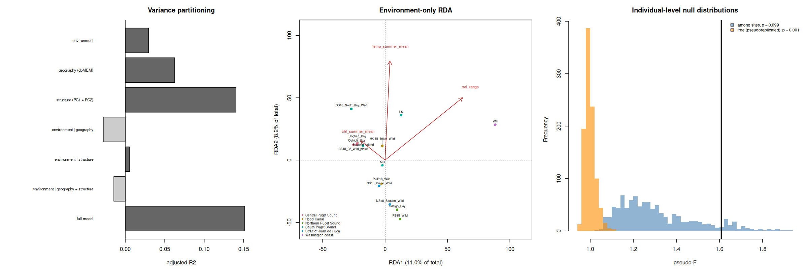
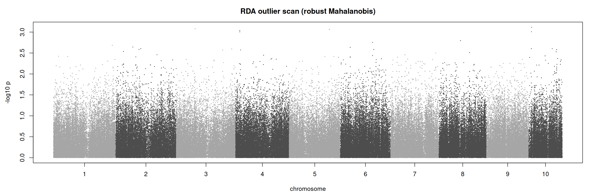

Asks whether population allele frequencies covary with the site environment
once geography and neutral structure are accounted for, and which loci drive
any association. The response is the matrix of per-population minor-allele
frequencies at the step 06 SNPs, estimated from genotype likelihoods; the
predictors are the step 08 site climatologies.

Ported from the earlier Olurida_v081 analysis (hard-call VCF, read-pooled
frequencies), with the same model set:

- **Variance partitioning**: environment, geography (dbMEM) and structure
  (PCAngsd PC1 and PC2), marginal and conditional, plus the full model.
- **Permutation tests** (999) for each model globally, by term (marginal) and
  by axis; forward selection with `ordiR2step`.
- **Temperature only** across all 15 sites: the one predictor that also exists
  for Coos Bay, which has no Ecology station.
- **Individual level**: the same environment model on individuals, tested by
  permuting predictors among whole sites (individuals in a site share its
  values, so they are not independent replicates), shown next to the
  pseudoreplicated free permutation.
- **Sensitivity**: the two Fidalgo Bay collections pooled into one population.
- **Outlier scan** on the constrained axes (robust Mahalanobis, Capblancq and
  Forester 2021), reported with q-values.

**How the response is handled.** With n populations and millions of SNPs the
RDA depends on the response only through its row space, so the
`09_rda_genotypes.py reduce` job accumulates the n x n Gram matrix of the
SNP-standardised frequency matrix and passes its principal coordinates to
vegan. Eigenvalues, R2, F and permutation p are identical to fitting the full
matrix; each fit asserts total inertia equal to the SNP count. SNP loadings are
recovered afterwards by projecting each standardised SNP onto the constrained
axes (`scan` job).

Inputs and outputs:

- Genotype likelihoods: `output/06_angsd_structure/gl/NNN_*.beagle.gz` (step 06,
  per window; Beagle columns follow `samples/samples.tsv`)
- Structure: `output/06_angsd_structure/tables/pca_scores.tsv`
- Predictors: `output/08_environmental_predictors/tables/site-env-matrix.tsv`
  and its `metadata.json` (selected predictors)
- Output: `output/09_rda/` — `inputs/` (population sets, principal
  coordinates), `work/` (per-window frequencies and all loadings; large,
  gitignored), `tables/`, `figures/`, `logs/`, `metadata.json`

The Python jobs use the step 06 `angsd` conda env (numpy and pandas only). The
R chunks need `vegan` and `jsonlite`.

**Running on klone.** R is not on the klone PATH, and the Roberts Lab R
container has no `sbatch`, so the Rmd cannot be knitted top to bottom there.
Run the bash chunks in order from a shell on the host. Each R chunk is
`eval = FALSE` and is run by the `*-job` bash chunk before it: that chunk
extracts the R chunk from this file and runs it as a SLURM job in the
container (`r_job.sh`, written by the `r-job` chunk), with single-threaded
OpenBLAS (the container default oversubscribes and makes the permutation fits
about 30x slower). Elsewhere, with R and vegan installed, the R chunks run
as-is in RStudio.

```{r setup, include=FALSE}
# Paths are relative to code/, so chunks work the same run one at a time or knitted
knitr::opts_chunk$set(echo = TRUE, eval = TRUE)
```

# Directories

```{bash dirs}
set -euo pipefail
mkdir -p ../output/09_rda/{inputs,work,tables,figures,logs,tmp}
ls ../output/09_rda
```

# R chunk runner

Writes `output/09_rda/tmp/r_job.sh`, a SLURM script that runs the named R
chunks of this file, in the order given, in the R container. The jobs are
short (under a minute each) and go to the coenv `compute` node; the `*-job`
chunks submit with `--wait` so the next step can follow directly.

```{bash r-job}
set -euo pipefail
repo=$(cd .. && pwd)
out=output/09_rda
container=/mmfs1/gscratch/srlab/containers/srlab-R4.4-bioinformatics-container-46b5d9e.sif

cat > ${repo}/${out}/tmp/r_job.sh <<EOF
#!/bin/bash
#SBATCH --job-name=oly-rda-r
#SBATCH --account=coenv
#SBATCH --partition=compute
#SBATCH --cpus-per-task=2
#SBATCH --mem=16G
#SBATCH --time=2:00:00
#SBATCH --output=${repo}/${out}/logs/r_%j.out
#SBATCH --chdir=${repo}/code
# usage: sbatch --wait ${out}/tmp/r_job.sh <chunk-label> [<chunk-label> ...]
set -euo pipefail
export OPENBLAS_NUM_THREADS=1 OMP_NUM_THREADS=1 MKL_NUM_THREADS=1
script=${repo}/${out}/tmp/r_job_\${SLURM_JOB_ID}.R
: > "\${script}"
for label in "\$@"; do
  awk -v label="\${label}" '\$0 ~ "^\`\`\`[{]r " label "[,}]" {f = 1; next} f && /^\`\`\`\$/ {exit} f' 09_rda.Rmd > "\${script}.part"
  [[ -s "\${script}.part" ]] || { echo "no R chunk labelled \${label}" >&2; exit 1; }
  cat "\${script}.part" >> "\${script}"
done
rm -f "\${script}.part"
echo "start \$(date -u +%FT%TZ) host \$(hostname) chunks: \$*"
apptainer exec ${container} Rscript "\${script}"
echo "end \$(date -u +%FT%TZ)"
EOF
echo "wrote ${out}/tmp/r_job.sh"
```

# Population sets

Each set is a list of units (populations) for one response matrix. `env` is
every site with all selected predictors (step 08 `in_env_model`); `all` is
every site, for the temperature-only models; `env_merge_fidalgo` pools the
individuals of the two Fidalgo Bay collections, which share coordinates and an
Ecology station.

```{bash population-sets-job}
set -euo pipefail
cd ..
sbatch --wait output/09_rda/tmp/r_job.sh population-sets
tail -n +2 output/09_rda/inputs/population-sets.tsv | cut -f1 | sort | uniq -c
```

```{r population-sets, eval = FALSE}
out <- "../output/09_rda"
site <- read.delim("../output/08_environmental_predictors/tables/site-env-matrix.tsv", stringsAsFactors = FALSE)
samples <- read.delim("../output/06_angsd_structure/samples/samples.tsv", stringsAsFactors = FALSE)
stopifnot(setequal(site$location, unique(samples$location)))

env_sites <- sort(site$location[as.logical(site$in_env_model)])   # written by pandas as True/False
fidalgo <- c("FB18_Wild", "Fidalgo_Bay")
sets <- rbind(
  data.frame(set = "env", unit = env_sites, location = env_sites),
  data.frame(set = "all", unit = sort(site$location), location = sort(site$location)))
if (all(fidalgo %in% env_sites)) {
  merged <- paste(fidalgo, collapse = "+")
  rest <- setdiff(env_sites, fidalgo)
  sets <- rbind(sets, data.frame(set = "env_merge_fidalgo",
                                 unit = c(rep(merged, 2), rest), location = c(fidalgo, rest)))
}
write.table(sets, file.path(out, "inputs/population-sets.tsv"), sep = "\t", quote = FALSE, row.names = FALSE)
table(sets$set)
setdiff(site$location, env_sites)   # sites left out of the environmental model
```

# Frequencies and principal coordinates

One SLURM job. Windows are processed in parallel (one process per window); peak
memory is about 1.5 GB per process.

```{bash reduce}
set -euo pipefail
repo=$(cd .. && pwd)
out=output/09_rda
env=/mmfs1/gscratch/srlab/sr320/miniforge3/envs/angsd/bin
threads=16

cd "${repo}"
${env}/python -c "import numpy, pandas" || { echo "install pandas into the angsd env: mamba install -n angsd pandas" >&2; exit 1; }
nwin=$(ls output/06_angsd_structure/gl/[0-9][0-9][0-9]_*.beagle.gz | wc -l)
echo "${nwin} Beagle windows"

cat > ${out}/tmp/reduce.sh <<EOF
#!/bin/bash
#SBATCH --job-name=oly-rda-reduce
#SBATCH --account=coenv
#SBATCH --partition=cpu-g2
#SBATCH --cpus-per-task=${threads}
#SBATCH --mem=64G
#SBATCH --time=12:00:00
#SBATCH --output=${repo}/${out}/logs/reduce_%j.out
#SBATCH --chdir=${repo}
set -euo pipefail
echo "start \$(date -u +%FT%TZ) host \$(hostname)"
${env}/python code/09_rda_genotypes.py reduce --threads ${threads} --save-sets env --individual-set env
echo "end \$(date -u +%FT%TZ)"
EOF

jid=$(sbatch --parsable ${out}/tmp/reduce.sh)
echo "${jid}" > ${out}/tmp/reduce.jobid
echo "submitted reduce job ${jid}"
```

# Status

```{bash status}
set -u
out=../output/09_rda
for name in reduce scan; do
  f=${out}/tmp/${name}.jobid; [[ -s "$f" ]] || continue
  jid=$(cat "$f"); printf "%-8s job %-10s " "$name" "$jid"
  squeue -h -j "$jid" -o "%T %M" 2>/dev/null || true; echo
done
ls ${out}/inputs/*-pcoa.tsv 2>/dev/null
[[ -s ${out}/tables/outlier-summary.tsv ]] && cat ${out}/tables/outlier-summary.tsv
grep -l -E "Error|error|Killed|OOM|No space" ${out}/logs/*.out 2>/dev/null | head
```

# RDA models

Population-level models on the `env` set, the temperature-only models on `all`,
the individual-level tests, and the pooled-Fidalgo refit. Writes the
constrained-axis unit scores that the scan job projects SNPs onto. Takes about
a minute as a job; most of it is the 999 site-level permutations of the
individual-level models.

```{bash rda-models-job}
set -euo pipefail
cd ..
sbatch --wait output/09_rda/tmp/r_job.sh rda-models
log=$(ls -t output/09_rda/logs/r_*.out | head -1)
grep -v "^WARNING" "${log}"
```

```{r rda-models, eval = FALSE}
suppressPackageStartupMessages(library(vegan))
set.seed(42)
out <- "../output/09_rda"
nperm <- 999
n_mem <- 2   # dbMEM axes used as the geographic conditioning term

meta08 <- jsonlite::fromJSON("../output/08_environmental_predictors/metadata.json")
reduce_meta <- jsonlite::fromJSON(file.path(out, "inputs/reduce-metadata.json"))
PRED <- meta08$parameters$predictors
site <- read.delim("../output/08_environmental_predictors/tables/site-env-matrix.tsv", stringsAsFactors = FALSE)
pca <- read.delim("../output/06_angsd_structure/tables/pca_scores.tsv", stringsAsFactors = FALSE)
site <- merge(site, aggregate(cbind(PC1, PC2) ~ location, data = pca, FUN = mean), by = "location")
sets <- read.delim(file.path(out, "inputs/population-sets.tsv"), stringsAsFactors = FALSE)

# predictors per unit: the mean over member locations (identical for the pooled Fidalgo pair)
unit_data <- function(set_name) {
  s <- sets[sets$set == set_name, ]
  num <- names(site)[sapply(site, is.numeric)]
  d <- do.call(rbind, lapply(unique(s$unit), function(u) {
    rows <- site[site$location %in% s$location[s$unit == u], ]
    data.frame(unit = u, region = rows$region[1], t(colMeans(rows[, num, drop = FALSE])), check.names = FALSE)
  }))
  rownames(d) <- d$unit
  d
}
read_response <- function(set_name) {
  Y <- as.matrix(read.delim(file.path(out, "inputs", paste0(set_name, "-pcoa.tsv")), row.names = 1, check.names = FALSE))
  n_snp <- reduce_meta$sets[[set_name]]$n_snp
  stopifnot(abs(sum(apply(Y, 2, var)) - n_snp) < 1e-3 * n_snp)
  Y
}
fml <- function(lhs, rhs) as.formula(paste(lhs, "~", rhs))
r2 <- function(m) unlist(RsquareAdj(m)[c("r.squared", "adj.r.squared")])
tests <- function(m, model) {
  g <- anova(m, permutations = nperm)
  rows <- list(data.frame(model = model, scope = "global", term = "constrained", df = g$Df[1],
                          variance = g$Variance[1], F = g$F[1], p = g$`Pr(>F)`[1]))
  if (m$CCA$rank > 1 || length(attr(terms(m), "term.labels")) > 1) {
    tt <- anova(m, by = "margin", permutations = nperm)
    ax <- anova(m, by = "axis", permutations = nperm)
    rows <- c(rows, list(
      data.frame(model = model, scope = "term (marginal)", term = rownames(tt), df = tt$Df,
                 variance = tt$Variance, F = tt$F, p = tt$`Pr(>F)`),
      data.frame(model = model, scope = "axis", term = rownames(ax), df = ax$Df,
                 variance = ax$Variance, F = ax$F, p = ax$`Pr(>F)`)))
  }
  do.call(rbind, rows)
}

## ---- population level, env set -------------------------------------------------
E <- unit_data("env"); Y <- read_response("env")
stopifnot(identical(rownames(Y), rownames(E)))
GEO <- head(grep("^MEM[0-9]+$", names(E), value = TRUE), n_mem)
env_rhs <- paste(PRED, collapse = " + "); geo_rhs <- paste(GEO, collapse = " + "); str_rhs <- "PC1 + PC2"
models <- list(
  env      = rda(fml("Y", env_rhs), data = E),
  geo      = rda(fml("Y", geo_rhs), data = E),
  str      = rda(fml("Y", str_rhs), data = E),
  env_geo  = rda(fml("Y", paste(env_rhs, "+ Condition(", geo_rhs, ")")), data = E),
  env_str  = rda(fml("Y", paste(env_rhs, "+ Condition(", str_rhs, ")")), data = E),
  env_both = rda(fml("Y", paste(env_rhs, "+ Condition(", geo_rhs, "+", str_rhs, ")")), data = E),
  full     = rda(fml("Y", paste(env_rhs, "+", geo_rhs, "+", str_rhs)), data = E))
labels <- c(env = "environment", geo = "geography (dbMEM)", str = "structure (PC1 + PC2)",
            env_geo = "environment | geography", env_str = "environment | structure",
            env_both = "environment | geography + structure", full = "full model")
vp <- data.frame(model = names(models), component = labels[names(models)],
                 t(sapply(models, r2)), row.names = NULL)
names(vp)[3:4] <- c("r2", "r2_adj")
write.table(vp, file.path(out, "tables/variance-partition.tsv"), sep = "\t", quote = FALSE, row.names = FALSE)

v_env <- vif.cca(models$env); v_full <- vif.cca(models$full)
write.table(rbind(data.frame(model = "env", term = names(v_env), vif = v_env),
                  data.frame(model = "full", term = names(v_full), vif = v_full)),
            file.path(out, "tables/vif.tsv"), sep = "\t", quote = FALSE, row.names = FALSE)

sel <- ordiR2step(rda(Y ~ 1, data = E), scope = fml("Y", env_rhs), permutations = nperm,
                  R2scope = TRUE, trace = FALSE)
sel_tab <- as.data.frame(sel$anova)
sel_tab <- if (nrow(sel_tab)) cbind(step = rownames(sel_tab), sel_tab) else data.frame(step = "none admitted")
write.table(sel_tab, file.path(out, "tables/forward-selection.tsv"), sep = "\t", quote = FALSE, row.names = FALSE)

sig <- do.call(rbind, lapply(c("env", "geo", "str", "env_geo", "env_str", "env_both"),
                             function(nm) tests(models[[nm]], nm)))
write.table(sig, file.path(out, "tables/significance-tests.tsv"), sep = "\t", quote = FALSE, row.names = FALSE)

## ---- temperature only, all sites ----------------------------------------------
Ea <- unit_data("all"); Ya <- read_response("all")
stopifnot(identical(rownames(Ya), rownames(Ea)), !anyNA(Ea$temp_summer_mean))
temp_rows <- list()
for (cond in c("none", "MEMall1", "PC1 + PC2")) {
  rhs <- if (cond == "none") "temp_summer_mean" else paste("temp_summer_mean + Condition(", cond, ")")
  m <- rda(fml("Ya", rhs), data = Ea); g <- anova(m, permutations = nperm)
  temp_rows[[cond]] <- data.frame(set = "all", n_units = nrow(Ya), n_snp = reduce_meta$sets$all$n_snp,
                                  conditioning = cond, r2 = r2(m)[1], r2_adj = r2(m)[2], F = g$F[1], p = g$`Pr(>F)`[1])
}
m <- rda(Y ~ temp_summer_mean, data = E); g <- anova(m, permutations = nperm)
temp_rows$env <- data.frame(set = "env", n_units = nrow(Y), n_snp = reduce_meta$sets$env$n_snp,
                            conditioning = "none", r2 = r2(m)[1], r2_adj = r2(m)[2], F = g$F[1], p = g$`Pr(>F)`[1])
write.table(do.call(rbind, temp_rows), file.path(out, "tables/temperature-only-models.tsv"),
            sep = "\t", quote = FALSE, row.names = FALSE)

## ---- individual level: permute predictors among whole sites ----------------------
X <- read.delim(file.path(out, "inputs/individual-pcoa.tsv"), stringsAsFactors = FALSE)
Xi <- as.matrix(X[, grep("^PCo", names(X))])
stopifnot(abs(sum(apply(Xi, 2, var)) - reduce_meta$sets$individual$n_snp) < 1e-3 * reduce_meta$sets$individual$n_snp)
units <- rownames(E)
idx <- match(X$location, units)
stopifnot(!anyNA(idx))
site_data <- function(map) E[units[map[idx]], c(PRED, GEO), drop = FALSE]
Fstat <- function(m) {
  df_c <- m$CCA$rank
  df_r <- nrow(m$CCA$u) - 1 - df_c - if (is.null(m$pCCA)) 0 else m$pCCA$rank
  (m$CCA$tot.chi / df_c) / (m$CA$tot.chi / df_r)
}
site_perm <- function(rhs) {
  f <- fml("Xi", rhs)
  m <- rda(f, data = site_data(seq_along(units)))
  null <- replicate(nperm, Fstat(rda(f, data = site_data(sample(seq_along(units))))))
  list(m = m, F = Fstat(m), p = (1 + sum(null >= Fstat(m))) / (1 + nperm), null = null)
}
ind_rows <- list()
for (nm in c("env", "env_geo", PRED)) {
  rhs <- switch(nm, env = env_rhs, env_geo = paste(env_rhs, "+ Condition(", geo_rhs, ")"), nm)
  z <- site_perm(rhs)
  ind_rows[[nm]] <- data.frame(model = nm, permutation = "among sites", n_individuals = nrow(Xi),
                               r2_adj = RsquareAdj(z$m)$adj.r.squared, F = z$F, p = z$p)
  if (nm == "env") { null_site <- z$null; F_obs <- z$F }
}
m_free <- rda(fml("Xi", env_rhs), data = site_data(seq_along(units)))
null_free <- replicate(nperm, Fstat(rda(fml("Xi", env_rhs), data = site_data(seq_along(units))[sample(nrow(Xi)), ])))
ind_rows$free <- data.frame(model = "env", permutation = "free (pseudoreplicated)", n_individuals = nrow(Xi),
                            r2_adj = RsquareAdj(m_free)$adj.r.squared, F = Fstat(m_free),
                            p = (1 + sum(null_free >= Fstat(m_free))) / (1 + nperm))
write.table(do.call(rbind, ind_rows), file.path(out, "tables/individual-level-tests.tsv"),
            sep = "\t", quote = FALSE, row.names = FALSE)
write.table(data.frame(permutation = rep(c("among sites", "free"), each = nperm), F = c(null_site, null_free)),
            file.path(out, "tables/individual-permutation-null.tsv"), sep = "\t", quote = FALSE, row.names = FALSE)

## ---- sensitivity: Fidalgo collections pooled -------------------------------------
sens <- NULL
if ("env_merge_fidalgo" %in% sets$set) {
  Em <- unit_data("env_merge_fidalgo"); Ym <- read_response("env_merge_fidalgo")
  stopifnot(identical(rownames(Ym), rownames(Em)))
  a <- rda(fml("Ym", env_rhs), data = Em)
  b <- rda(fml("Ym", paste(env_rhs, "+ Condition(", geo_rhs, ")")), data = Em)
  sens <- data.frame(scenario = c("primary", "Fidalgo collections pooled"),
                     n_units = c(nrow(Y), nrow(Ym)),
                     n_snp = c(reduce_meta$sets$env$n_snp, reduce_meta$sets$env_merge_fidalgo$n_snp),
                     env_r2_adj = c(r2(models$env)[2], r2(a)[2]),
                     env_p = c(anova(models$env, permutations = nperm)$`Pr(>F)`[1], anova(a, permutations = nperm)$`Pr(>F)`[1]),
                     env_given_geo_r2_adj = c(r2(models$env_geo)[2], r2(b)[2]),
                     env_given_geo_p = c(anova(models$env_geo, permutations = nperm)$`Pr(>F)`[1],
                                         anova(b, permutations = nperm)$`Pr(>F)`[1]))
  write.table(sens, file.path(out, "tables/sensitivity-refits.tsv"), sep = "\t", quote = FALSE, row.names = FALSE)
}

## ---- scores for the scan and the figures --------------------------------------------
# Linear-combination unit scores (CCA$u): a SNP's loading on axis k is its
# standardised frequency vector dotted with u_k, up to a per-axis constant.
write.table(models$env$CCA$u, file.path(out, "tables/axis-unit-scores.tsv"), sep = "\t", quote = FALSE, col.names = NA)
sc <- scores(models$env, display = c("sites", "bp"), scaling = 2, choices = 1:2)
write.table(data.frame(unit = rownames(sc$sites), region = E$region, sc$sites),
            file.path(out, "tables/rda-unit-scores.tsv"), sep = "\t", quote = FALSE, row.names = FALSE)
write.table(data.frame(term = rownames(sc$biplot), sc$biplot),
            file.path(out, "tables/rda-biplot-scores.tsv"), sep = "\t", quote = FALSE, row.names = FALSE)
write.table(data.frame(axis = names(models$env$CCA$eig), eigenvalue = models$env$CCA$eig,
                       prop_constrained = models$env$CCA$eig / models$env$CCA$tot.chi,
                       prop_total = models$env$CCA$eig / models$env$tot.chi),
            file.path(out, "tables/rda-eigenvalues.tsv"), sep = "\t", quote = FALSE, row.names = FALSE)
saveRDS(list(models = models, E = E, predictors = PRED, geography = GEO), file.path(out, "work/rda-models.rds"))

vp
sig[sig$scope == "global", ]
do.call(rbind, ind_rows)
```

# Outlier scan

Projects every SNP of the `env` set onto the constrained axes and tests for
outliers. Run after `rda-models`.

```{bash scan}
set -euo pipefail
repo=$(cd .. && pwd)
out=output/09_rda
env=/mmfs1/gscratch/srlab/sr320/miniforge3/envs/angsd/bin
threads=16

cd "${repo}"
[[ -s ${out}/tables/axis-unit-scores.tsv ]] || { echo "run the rda-models chunk first" >&2; exit 1; }
cat > ${out}/tmp/scan.sh <<EOF
#!/bin/bash
#SBATCH --job-name=oly-rda-scan
#SBATCH --account=coenv
#SBATCH --partition=cpu-g2
#SBATCH --cpus-per-task=${threads}
#SBATCH --mem=64G
#SBATCH --time=4:00:00
#SBATCH --output=${repo}/${out}/logs/scan_%j.out
#SBATCH --chdir=${repo}
set -euo pipefail
echo "start \$(date -u +%FT%TZ) host \$(hostname)"
${env}/python code/09_rda_genotypes.py scan --threads ${threads} --set env --seed 42
echo "end \$(date -u +%FT%TZ)"
EOF

jid=$(sbatch --parsable ${out}/tmp/scan.sh)
echo "${jid}" > ${out}/tmp/scan.jobid
echo "submitted scan job ${jid}"
```

# Figures

Run after the scan job has finished (the Manhattan plot reads its thinned
p-values). One job draws the figures and then writes the metadata.

```{bash figures-job}
set -euo pipefail
cd ..
sbatch --wait output/09_rda/tmp/r_job.sh figures metadata
log=$(ls -t output/09_rda/logs/r_*.out | head -1)
grep -v "^WARNING" "${log}" | tail -5
ls -l output/09_rda/figures
```

```{r figures, eval = FALSE}
out <- "../output/09_rda"
vp <- read.delim(file.path(out, "tables/variance-partition.tsv"), stringsAsFactors = FALSE)
us <- read.delim(file.path(out, "tables/rda-unit-scores.tsv"), stringsAsFactors = FALSE)
bp <- read.delim(file.path(out, "tables/rda-biplot-scores.tsv"), stringsAsFactors = FALSE)
eig <- read.delim(file.path(out, "tables/rda-eigenvalues.tsv"), stringsAsFactors = FALSE)
nulls <- read.delim(file.path(out, "tables/individual-permutation-null.tsv"), stringsAsFactors = FALSE)
ind <- read.delim(file.path(out, "tables/individual-level-tests.tsv"), stringsAsFactors = FALSE)

png(file.path(out, "figures/rda-summary.png"), width = 2400, height = 800, res = 150)
par(mfrow = c(1, 3), mar = c(4.5, 4.5, 3, 1))

# variance partitioning
par(mar = c(4.5, 15, 3, 1))
o <- rev(seq_len(nrow(vp)))
barplot(vp$r2_adj[o], names.arg = vp$component[o], horiz = TRUE, las = 1, cex.names = 0.7,
        col = ifelse(vp$r2_adj[o] > 0, "grey40", "grey80"), xlab = "adjusted R2",
        main = "Variance partitioning", xlim = range(c(0, vp$r2_adj)) * 1.15)
abline(v = 0)
par(mar = c(4.5, 4.5, 3, 1))

# triplot
regions <- sort(unique(us$region)); pal <- setNames(hcl.colors(length(regions), "Dark 3"), regions)
lim <- range(c(us$RDA1, us$RDA2, bp$RDA1, bp$RDA2)) * 1.2
plot(us$RDA1, us$RDA2, pch = 16, col = pal[us$region], xlim = lim, ylim = lim, asp = 1,
     xlab = sprintf("RDA1 (%.1f%% of total)", 100 * eig$prop_total[1]),
     ylab = sprintf("RDA2 (%.1f%% of total)", 100 * eig$prop_total[2]), main = "Environment-only RDA")
s <- 0.9 * max(abs(c(us$RDA1, us$RDA2))) / max(abs(c(bp$RDA1, bp$RDA2)))
arrows(0, 0, s * bp$RDA1, s * bp$RDA2, length = 0.08, col = "firebrick")
# Site and predictor labels share one pass that pushes overlapping labels apart
# vertically (the Central Puget Sound sites and the chlorophyll arrow tip
# coincide); a moved label gets a grey leader line back to its anchor.
repel_text <- function(x, y, labels, cex, col, iter = 500) {
  w <- mapply(function(l, k) strwidth(l, cex = k), labels, cex) * 1.1
  h <- mapply(function(l, k) strheight(l, cex = k), labels, cex) * 1.8
  ly <- y + h * 0.8
  for (k in seq_len(iter)) {
    moved <- FALSE
    for (i in seq_along(x)) for (j in seq_along(x)) if (i < j) {
      ox <- (w[i] + w[j]) / 2 - abs(x[j] - x[i]); oy <- (h[i] + h[j]) / 2 - abs(ly[j] - ly[i])
      if (ox > 0 && oy > 0) {
        d <- if (ly[j] >= ly[i]) 1 else -1
        ly[i] <- ly[i] - d * (oy / 2 + 1e-6); ly[j] <- ly[j] + d * (oy / 2 + 1e-6); moved <- TRUE
      }
    }
    if (!moved) break
  }
  lead <- abs(ly - y) > 1.2 * h
  segments(x[lead], y[lead], x[lead], ly[lead] - sign(ly[lead] - y[lead]) * h[lead] / 3, col = "grey60", lwd = 0.6)
  text(x, ly, labels, cex = cex, col = col)
}
repel_text(c(us$RDA1, 1.1 * s * bp$RDA1), c(us$RDA2, 1.1 * s * bp$RDA2), c(us$unit, bp$term),
           cex = rep(c(0.55, 0.7), c(nrow(us), nrow(bp))),
           col = rep(c("black", "firebrick"), c(nrow(us), nrow(bp))))
legend("bottomleft", legend = regions, col = pal, pch = 16, cex = 0.6, bty = "n")
abline(h = 0, v = 0, lty = 3)

# individual level: null distributions
F_obs <- ind$F[ind$model == "env" & ind$permutation == "among sites"]
br <- pretty(range(c(nulls$F, F_obs)), 40)
h1 <- hist(nulls$F[nulls$permutation == "among sites"], breaks = br, plot = FALSE)
h2 <- hist(nulls$F[nulls$permutation == "free"], breaks = br, plot = FALSE)
plot(h1, col = adjustcolor("steelblue", 0.6), border = NA, ylim = c(0, max(h1$counts, h2$counts)),
     xlab = "pseudo-F", main = "Individual-level null distributions")
plot(h2, col = adjustcolor("darkorange", 0.6), border = NA, add = TRUE)
abline(v = F_obs, lwd = 2)
legend("topright", bty = "n", cex = 0.75, fill = adjustcolor(c("steelblue", "darkorange"), 0.6),
       legend = sprintf("%s, p = %.3f", c("among sites", "free (pseudoreplicated)"),
                        ind$p[ind$model == "env" & ind$permutation %in% c("among sites", "free (pseudoreplicated)")]))
dev.off()

# Manhattan of the outlier scan
mf <- file.path(out, "tables/manhattan-thinned.tsv.gz")
if (file.exists(mf)) {
  m <- read.delim(gzfile(mf), stringsAsFactors = FALSE)
  chroms <- readLines("../output/06_angsd_structure/samples/chromosomes.txt")
  m <- m[m$chrom %in% chroms, ]
  m$ci <- match(m$chrom, chroms)
  ends <- tapply(m$pos, m$ci, max); offset <- c(0, cumsum(as.numeric(ends)))[seq_along(ends)]
  m$x <- m$pos + offset[m$ci]
  png(file.path(out, "figures/outlier-manhattan.png"), width = 2400, height = 800, res = 150)
  par(mar = c(4.5, 4.5, 3, 1))
  plot(m$x, -log10(m$p_value), pch = 16, cex = 0.3, col = c("grey30", "grey65")[m$ci %% 2 + 1],
       xaxt = "n", xlab = "chromosome", ylab = "-log10 p", main = "RDA outlier scan (robust Mahalanobis)")
  axis(1, at = offset + ends / 2, labels = names(ends))
  sig <- m$q_value < 0.05
  if (any(sig)) points(m$x[sig], -log10(m$p_value[sig]), pch = 16, cex = 0.5, col = "firebrick")
  dev.off()
}
```





# Metadata

```{r metadata, eval = FALSE}
out <- "../output/09_rda"
repo_rel <- function(p) sub("^\\.\\./", "", p)
reduce_meta <- jsonlite::fromJSON(file.path(out, "inputs/reduce-metadata.json"))
scan_meta <- if (file.exists(file.path(out, "logs/scan-metadata.json"))) jsonlite::fromJSON(file.path(out, "logs/scan-metadata.json")) else NULL
meta08 <- jsonlite::fromJSON("../output/08_environmental_predictors/metadata.json")
metadata <- list(
  script = "09_rda.Rmd",
  date = format(Sys.time(), "%Y-%m-%dT%H:%M:%SZ", tz = "UTC"),
  runtime_seconds = sum(reduce_meta$runtime_seconds, scan_meta$runtime_seconds),
  parameters = list(
    predictors = meta08$parameters$predictors, geography = "dbMEM 1-2 (step 08)",
    structure = "population means of PCAngsd PC1 and PC2 (step 06)", permutations = 999, seed = 42,
    min_maf = reduce_meta$parameters$min_maf, allele_frequencies = "EM on genotype likelihoods per population (ANGSD Beagle, step 06)",
    individual_dosages = "posterior mean under HWE at the all-sample frequency",
    outlier_test = "robust (MCD) Mahalanobis on constrained-axis loadings, median-rescaled chi-square, BH q-values",
    slurm = list(account = "coenv", python_jobs = "cpu-g2", r_jobs = "compute"),
    container = "/mmfs1/gscratch/srlab/containers/srlab-R4.4-bioinformatics-container-46b5d9e.sif"
  ),
  inputs = c("output/06_angsd_structure/gl/NNN_*.beagle.gz", "output/06_angsd_structure/samples/samples.tsv",
             "output/06_angsd_structure/tables/pca_scores.tsv",
             "output/08_environmental_predictors/tables/site-env-matrix.tsv"),
  sets = reduce_meta$sets,
  outlier_scan = scan_meta$results,
  software = list(R = R.version.string, vegan = as.character(packageVersion("vegan")),
                  python = reduce_meta$software),
  outputs = list(
    inputs = repo_rel(list.files(file.path(out, "inputs"), full.names = TRUE)),
    tables = repo_rel(list.files(file.path(out, "tables"), full.names = TRUE)),
    figures = repo_rel(list.files(file.path(out, "figures"), full.names = TRUE)))
)
writeLines(jsonlite::toJSON(metadata, auto_unbox = TRUE, pretty = TRUE, na = "null", null = "null"),
           file.path(out, "metadata.json"))
cat(readLines(file.path(out, "metadata.json"), n = 30), sep = "\n")
```
