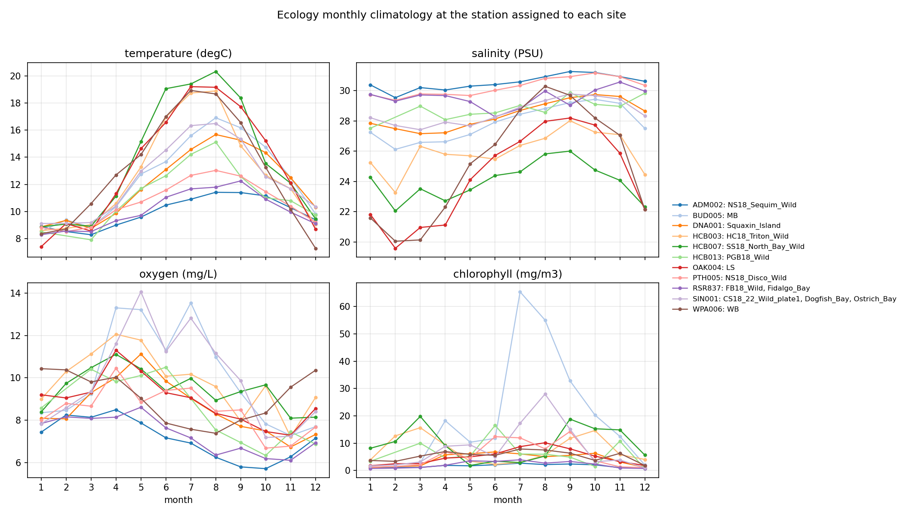

# 07 — Marine climatologies from WA Ecology and ORCA

Site-level environmental predictors for genotype-environment analyses (RDA),
produced by [`code/07_orca_ecology_data.py`](../../code/07_orca_ecology_data.py).
This replaces the 30-day NOAA snapshot of
[step 04](../04_environmental_data/README.md) as the environmental layer, following
[`docs/environmental-data-access-plan.md`](../../docs/environmental-data-access-plan.md).

## Method

- **Window:** 2015–2018, the years up to and including the 2018 collections.
- **Depth band:** 0–5 m, averaged within each profile (Ecology) or cast (ORCA).
- **WA Ecology** yearly marine-water profile netCDFs (monthly CTD casts). Only
  values with QC code 2 (Pass) are kept, and the `-99999.9` fill is dropped.
  Each site is assigned the nearest station within 25 km that has at least 12
  profiles in the window.
- **ORCA moorings** (NANOOS ERDDAP, L3 0.25 m gridded profiles), only QARTOD
  PASS (flag 1) values, for moorings within 30 km of a site. Cast means are
  averaged to daily values, which also give tail statistics (95th-percentile
  temperature, 5th-percentile oxygen and salinity, days above 18 °C or below
  4 mg/L).
- **Climatology:** per-(year, month) means, then the mean over years for each
  calendar month. Summaries per variable: annual mean (needs at least 10 months),
  summer (Jul–Sep) and winter (Dec–Feb) means, monthly max/min, and seasonal range.

## Station assignment and key predictors

\* = manual override (`STATION_OVERRIDES` in the script). Dogfish Bay drains
through Liberty Bay to Port Orchard. Its nearest station by straight-line
distance (HCB010, 14.6 km) is across the Kitsap Peninsula in Hood Canal, and
OCH014 in Liberty Bay was not sampled in 2015–2018. Dogfish Bay therefore uses
SIN001 (Sinclair Inlet), which is on the same passage system.

| Location | Station | km | Profiles | Temp annual (°C) | Temp summer (°C) | Salinity annual (PSU) | DO monthly min (mg/L) |
| --- | --- | ---: | ---: | ---: | ---: | ---: | ---: |
| `CS18_22_Wild_plate1` | SIN001 | 7.7 | 39 | 12.3 | 16.1 | 28.6 | 7.2 |
| `Coos_Bay` | — | — | — | — | — | — | — |
| `Dogfish_Bay` | SIN001 * | 16.3 | 39 | 12.3 | 16.1 | 28.6 | 7.2 |
| `FB18_Wild` | RSR837 | 19.8 | 38 | 10.1 | 11.9 | 29.5 | 6.1 |
| `Fidalgo_Bay` | RSR837 | 19.8 | 38 | 10.1 | 11.9 | 29.5 | 6.1 |
| `HC18_Triton_Wild` | HCB003 | 8.0 | 48 | 12.8 | 17.5 | 26.0 | 7.2 |
| `LS` | OAK004 | 6.9 | 46 | 13.3 | 18.7 | 24.3 | 7.3 |
| `MB` | BUD005 | 4.9 | 47 | 12.4 | 16.2 | 27.9 | 7.3 |
| `NS18_Disco_Wild` | PTH005 | 10.2 | 38 | 10.7 | 12.8 | 30.2 | 6.7 |
| `NS18_Sequim_Wild` | ADM002 | 19.6 | 40 | 9.9 | 11.2 | 30.5 | 5.7 |
| `Ostrich_Bay` | SIN001 | 5.4 | 39 | 12.3 | 16.1 | 28.6 | 7.2 |
| `PGB18_Wild` | HCB013 | 3.9 | 23 | 11.3 | 14.0 | 28.8 | 6.3 |
| `SS18_North_Bay_Wild` | HCB007 | 7.7 | 43 | 13.8 | 19.4 | 24.0 | 8.1 |
| `Squaxin_Island` | DNA001 | 4.3 | 47 | 12.0 | 15.2 | 28.4 | 6.7 |
| `WB` | WPA006 | 2.8 | 39 | 13.0 | 18.1 | 25.2 | 7.4 |

## Caveats for RDA

- **Shared stations.** SIN001 serves `CS18_22_Wild_plate1`, `Dogfish_Bay` and
  `Ostrich_Bay`; RSR837 serves `FB18_Wild` and `Fidalgo_Bay`. The 14 Washington
  sites therefore have **11 distinct environmental profiles**, and the
  environmental values are identical within each shared group.
- **Coos Bay has no data.** Ecology monitors Washington only, and no Oregon
  source has been added yet; South Slough NERR SWMP is the likely candidate.
  Either add one or drop Coos Bay from environment models.
- **Basin, not tideflat.** Ecology stations are mid-channel and cast once a
  month. They describe the water body around a site, not intertidal extremes.
  The BUD005 (Budd Inlet) chlorophyll bloom assigned to `MB` reflects Budd
  Inlet, which is adjacent to Eld Inlet but not the same basin.
- **Site coordinates are approximate centroids** from step 04, not recorded
  collection points.
- **ORCA not yet ingested.** Every NANOOS ERDDAP griddap request returned
  HTTP 503 on 2026-10-03 (metadata endpoints were up). Rerun the script once the
  service is back. Downloads are cached in `raw/`, so only missing years are
  requested, and `tables/site_summary_orca.tsv` will fill in.

## Contents

| File | Contents |
| --- | --- |
| `tables/site_predictors_ecology.tsv` | One row per site: assigned station, distance, and summary predictors (`temp_`, `sal_`, `do_`, `chl_` prefixes) |
| `tables/site_station_assignment.tsv` | Nearest and assigned Ecology station per site, profile counts, date span, nearest ORCA mooring |
| `tables/monthly_climatology.tsv` | Long table: location, source, station, variable, month, mean, years and observations behind it |
| `tables/ecology_profiles.tsv` | 0–5 m mean per Ecology profile, all stations, 2015–2018 |
| `tables/site_summary_orca.tsv` | ORCA summaries and daily-tail statistics per site (empty until the ERDDAP is reachable) |
| `figures/ecology_monthly_climatology.png` | Monthly climatology per assigned station |
| `metadata.json` | Parameters, source URLs, per-request ORCA status, counts, software versions |
| `raw/` | Cached netCDF and ERDDAP CSV downloads (gitignored) |
